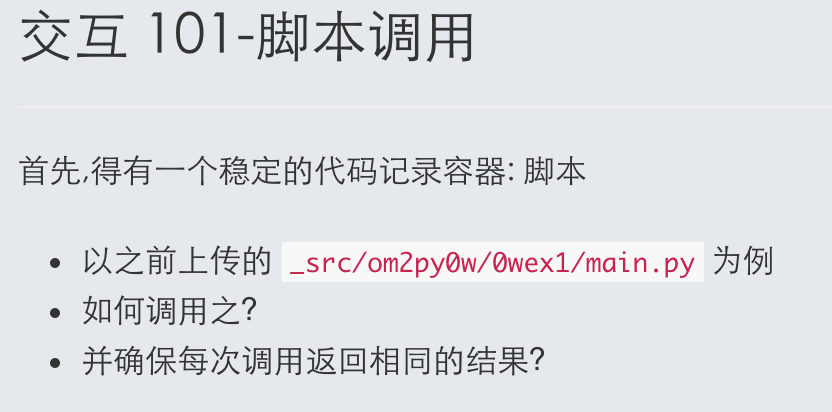

# 第1个版本

## 1.文档读写

参考了笨办法里面的关于文档读写的[代码](http://www.jb51.net/shouce/Pythonbbf/latest/ex16.html)，完成了初步的文档读写

    import sys 
    import time
    target = open("diary.txt", 'a+')
    print "Now I'm going to ask you for 1 lines."
    line1 = raw_input("line 1: ")
    print "I'm going to write these to the file."
    target.write(line1+"  ")
    target.write(time.strftime("%Y/%m/%d%H:%M:%S"))
    target.write("\n")

## 2.脚本调用

之前一直不懂第一张卡片的意思，什么叫如何调用之？

后来看了其他同学的gitbook输出，发现是从终端上调用脚本。在教练的帮助下解决了这个问题。

1）【cd 文档所在的文件夹】找到.py文件所在的目录 

2）【$ python 文档名称.py 】调用这个文档所包含的脚本了

## 3.第二个版本需要优化的地方
1）持续交互
    
    如何让用户可以持续性的输入

2）回读文本
    
    当用户需要回读的时候，如何让用户选择回读？

