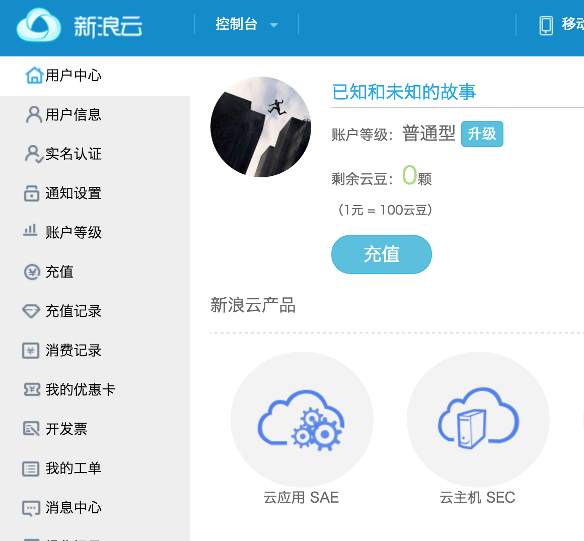

# 4w online class

## sae：新浪云

官方文档：http://www.sinacloud.com/doc/sae/index.html

注册成功！

[关键概念](http://www.sinacloud.com/doc/sae/tutorial/concept.html)

## Paas/saas/iaas

1）概念辨析

[IaaS（Infrastructure as a Service），即基础设施即服务](http://baike.baidu.com/link?url=ufA3eMUuOobItOYTWLG6lZMwr8gVLc-w_mYPk-E_3tYv18jLbQRegx0FtpNQwa5oC1wBgVqS4NJt6gjrMW4sM_)

这篇文章里面有关于三种概念的具体解释。

2）国内外PaaS平台大盘点

http://www.chinacloud.cn/show.aspx?id=15342&cid=17

使用python的有：a.Heroku b.SAE 

## 赖博士文档

https://wp-lai.gitbooks.io/learn-python/content/1sTry/sae.html

不断的学习中