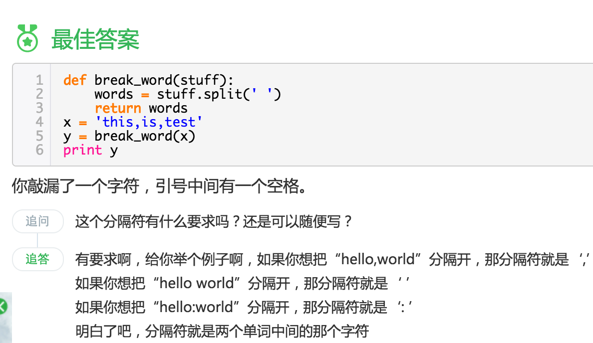

# 笨办法学python学习记录

## 笨办法1~17课

笨办法1~17是非常基础的练习。

变量、字符串打印、raw_input、参数、解包、读写文件。

比较有效的是[这篇文章](http://www.jb51.net/shouce/Pythonbbf/latest/ex16.html)，里面涉及到了大部分新的知识。

## 笨办法18~26课

这几节课主要学习了函数、变量和文件。

有几个新知识点
1）[readline](http://zhidao.baidu.com/link?url=cO0XTPkeGN-y0QGPdwV09WzL1KSZOI0-UKzlOVyG4JCNTSL7hpU9LcvxQTmmhGV4XnIMzfn2T0EibciV5qNE8GAGdax_aQcd7758IUbwROC) 
readline和readlines，read都是用来读取文件内容
readline()每次读取一行，当前位置移到下一行；
readlines()读取整个文件所有行，保存在一个列表(list)变量中，每行作为一个元素；
read(size)从文件当前位置起读取size个字节（如果文件结束，就读取到文件结束为止），如果size是负值或省略，读取到文件结束为止，返回结果是一个字符串。

2)seek()函数
以下是seek()方法的语法：
fileObject.seek(offset, whence)
参数
    offset -- 这是在文件中，读/写指针的位置。
    whence -- 这是可选的，默认为0，这意味着绝对的文件定位，其它的值是1，这意味着寻求相对于当前位置，2表示相对于文件的末尾。

[参考实践](http://www.jb51.net/article/66631.htm)

3)split 函数

不同格式的文本，不一样的操作方法

[参考stackflow](http://stackoverflow.com/questions/20826788/str-split-giving-me-valueerror-empty-separator-for-a-sentence-in-the-for)

4)pop()函数
pop()方法从列表移除并返回最后一个对象或obj。
[参考脚本之家](http://www.jb51.net/article/66459.htm)

