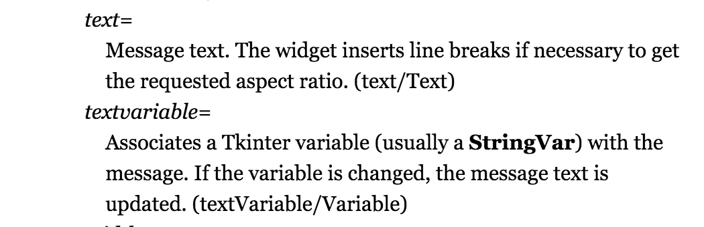

# Message控件的问题

## 问题

上周出现的一个情况是，花费了很多时间研究了Tkinter的Message 插件的问题，但是这个跟问题并不一定有很大程度的联系，导致浪费了很多时间。

花费时间研究的内容是：如何可以在以下程序中，让message中写入的是一个变量参数,而不是写死的text="this is a message"。
 
    from Tkinter import *
    master = Tk()
    
    e = Entry(master,width=50)
        e.pack()
        e.focus_set()
        e.get()
        
    w = Message(master, text="this is a message")
    w.pack()
    mainloop()
    

## 解决思路1

我尝试把上面的 text="this is a message" 换成了text=x，期待可以把键入entry的参数可以及时显示在GUI上面
    
    e = Entry(master,width=50)
    e.pack()
    e.focus_set()
    x=str(e.get())
    w = Message(master, text=x,width=100)
    w.pack(side=LEFT)

没有成功

## 正确的解决思路
看到文档里面有 textvariable

在这个问题上，我应该用textvariable,而不是text,修正后的代码如下

    v = StringVar()
        e = Entry(master, textvariable=v)
        e.pack()

        v.set("a default value")
        s = v.get()

        w = Message(master, textvariable=v,width=100)
        w.pack(side=LEFT)
