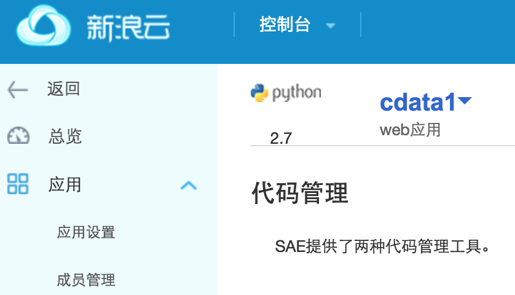
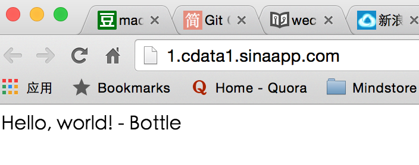
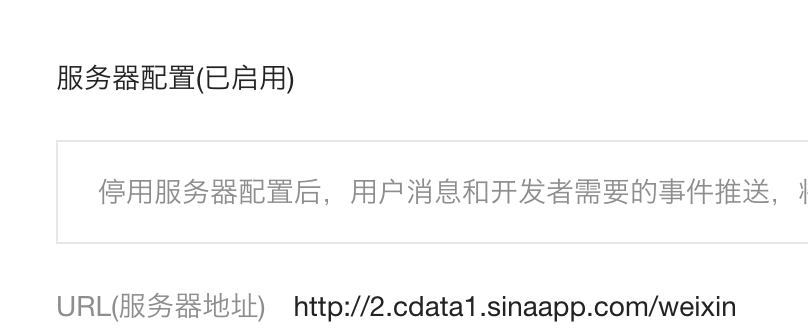

# 接入微信公众号

1.在SAE上创建Python应用

2.在SAE上部署代码
根据这篇文章的提示，进行代码部署

[代码部署手册](http://www.sinacloud.com/doc/sae/tutorial/code-deploy.html#svn?ticket=00052aff700e7a05bffcbc867d340f2754363ca7)

部署成功，上图

根据[微信公众平台后台接入简明指南](http://www.liaoxuefeng.com/article/0013900476318564121d01facf844cba508396f95d9bb82000)提示，在index.wsgi文件中放入以下代码

    def check_signature():
        # 第0步：获取参数
        token = "mytoken", # 这里将mytoken替换成自己设置的token
        timestamp = request.GET.get('timestamp', None) #用bottle里的request.GET.get函数来获得传入的'timestamp'的值
        nonce = request.GET.get('nonce', None) #同上方法获得'nonce'值
        signature = request.GET.get('signature', None)  #同上方法获得'signature'的值
        echostr = request.GET.get('echostr', None) #同上方法获得'echostr'的值

        # 第1步：将token、timestamp、nonce三个参数进行字典序排序
        mylist = sorted([token, timestamp, nonce]) #将token, timestamp和nonce组成一个列表，然后进行排序

        # 第2步：将三个参数字符串拼接成一个字符串进行sha1加密
        mystr = ''.join(mylist) #将三个参数字符串拼接成一个字符串
        import hashlib
        mystr_encoded = hashlib.sha1(mystr).hexdigest() # 对拼接字符串进行sha1加密

        # 第3步：开发者获得加密后的字符串可与signature对比，标识该请求来源于微信
        if mystr_encoded == signature:
            return echostr
        else:
            return None

3.申请消息接口并验证

1)消息接口配置

填写urL 
    
    2.cdata1.sinaapp.com 

其中2是指第二个版本。并填写token

2)消息接口验证（网址接入）

在这个过程中由于忘记填写 request
    
    "from bottle import Bottle, run, route, request"
导致服务器不能正确配置，微信平台服务器配置无法正常启用。

修改代码之后，接入成功！

