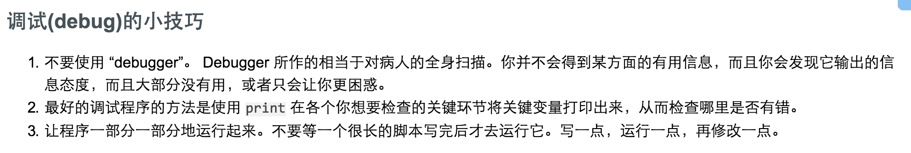

# 笨办法学python学习记录

## 笨办法27~38

27~29都比较简单，跳过

### 第30个习题
if...elif...else语句
[参考这个文档](http://book.51cto.com/art/200907/139859.htm)

### 第33个习题：
『回到 while 循环，它所作的和 if 语句类似，也是去检查一个布尔表达式的真假，不一样的是它下面的代码片段不是只被执行一次，而是执行完后再调回到 while 所在的位置，如此重复进行，直到 while 表达式为 False 为止。

While 循环有一个问题，那就是有时它会永不结束。如果你的目的是循环到宇宙毁灭为止，那这样也挺好的，不过其他的情况下你的循环总需要有一个结束点。』

### 第36个习题：关于debug

### 第37个习题

关于一些关键字的用法

[exec](http://www.jbxue.com/article/13367.html)

[lambda](http://blog.csdn.net/imzoer/article/details/8667176)

[yield](http://blog.csdn.net/buaa_shang/article/details/8281559)

[assert](http://www.jb51.net/article/65263.htm)

可以参考文章 [Python 错误和异常小结](http://www.jb51.net/article/41972.htm)
里面提到了几个语句
try...except
try ... except...else
 finally
 

