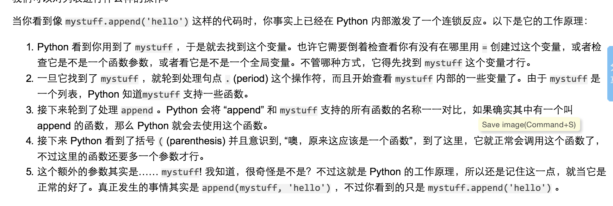

# 笨办法3


## 第39个习题1


mystuff.append('hello') 这样代码的执行过程


1）.(period)之后，python知道 mystuff支持一些函数，
2）然后python会将"append"和mystuff支持的所有函数对比，确认append这个函数
3）发了真正的事情，append(mystuff,"hello")


## 第39个习题2

```city = cities.get('TX', 'Does Not Exist')
print "The city for the state 'TX' is: %s" % city
```
Output: the city for the state "TX" is Does Not Exist.

Python 字典(Dictionary) get() 函数返回指定键的值，如果值不在字典中返回默认值。
点击[参考](http://www.runoob.com/python/att-dictionary-get.html)链接


## 第40个习题


### 列表和字典的区别

你可以使用数字作为列表的索引，也就是你可以通过数字找到列表中的元素。
而 dict 所作的，是让你可以通过任何东西找到元素，不只是数字。是的，字典可以将一个物件和另外一个东西关联，不管它们的类型是什么。


### 正确认识class1.0

class实在是太难了。
1.Python编程中类的概念可以比作是某种类型集合的描述，如“人类”可以被看作一个类，然后用人类这个类定义出每个具体的人——你、我、他等作为其对象。
2.类还拥有属性和功能，属性即类本身的一些特性，如人类有名字、身高和体重等属性，而具体值则会根据每个人的不同；功能则是类所能实现的行为，如人类拥有吃饭、走路和睡觉等功能。
3.这里的__init__()方法，类的实例被创建时，相当于一个构造器，但又和C++，C#等不同，它并不创建实例，仅仅是将我们创建好了对象后，执行的第一个方法，目的给是对象必要的初始化工作
3.__private_attrs  两个下划线开头，声明该属性为私有，不能在类地外部被使用或直接访问。在类内部的方法中使用时 self.__private_attrs
4.在类地内部，使用def关键字可以为类定义一个方法，与一般函数定义不同，类方法必须包含参数self,且为第一个参数
5.__private_method 两个下划线开头，声明该方法为私有方法，不能在类地外部调用。在类的内部调用self.__private_methods
6.Python中定义和使用类的形式为：class 类名[(父类名)]:[成员函数及成员变量]，类名为这个类的名称，而父类名为可选，但定义父类名后，子类则拥有父类的相应属性和方法。

关于class的概念入门，可以参考以下两篇文章
[python类定义的讲解](http://www.jb51.net/article/42623.htm)
[Python类的定义、继承及类对象使用方法简明教程](http://www.jb51.net/article/65704.htm)


```# 例：类的继承
class CAnimal:
  def __init__(self,voice='hello'): # voice初始化默认为hello,重载构造函数
    self.voice = voice               # 创建成员变量并赋初始值
  def Say(self):
    print self.voice
  def Run(self):
    pass  # 空操作语句（不做任何操作）
 
class CDog(CAnimal):    # 继承类CAnimal
  def SetVoice(self,voice): # 子类增加函数SetVoice
    self.voice = voice
  def Run(self,voice): # 子类重载函数Run
    print 'Running'
 
bobo = CDog()
bobo.SetVoice('My Name is BoBo!')   # 设置child.data为hello
bobo.Say()
bobo.Run()
 
>> My Name is BoBo!
>> Running```


### 正确认识class 2.0

可以阅读这一篇官方文档

[python中的class 官方](https://docs.python.org/2/tutorial/classes.html)

[python中的class 翻译](http://blog.csdn.net/on_1y/article/details/8640012)

同时，还可以通过codeacademy上面的python课程，进一步了解。有点手把手教学的感觉，很仔细。

另外还可以看一下这篇文章：[What is a metaclass in Python?](http://stackoverflow.com/questions/100003/what-is-a-metaclass-in-python)


