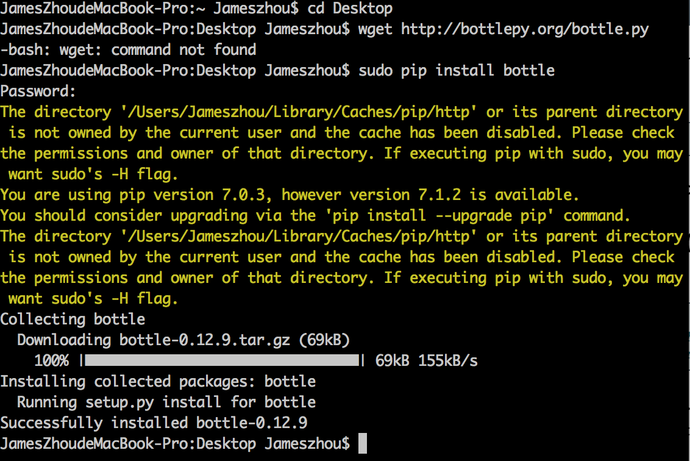
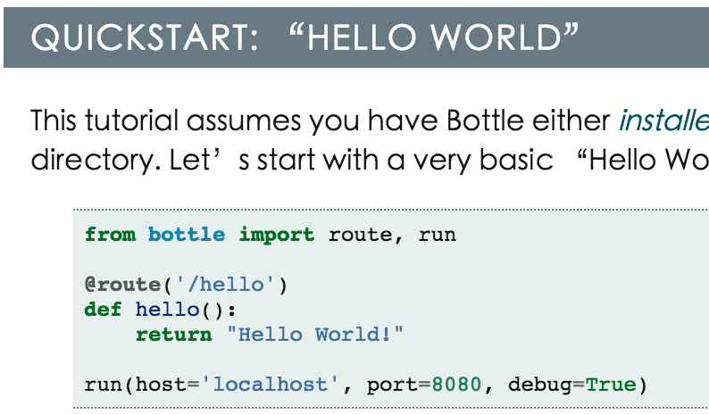
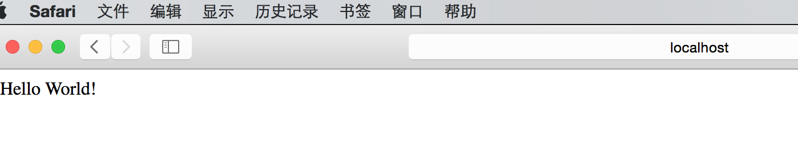

# Bottle

1.bottle是一种框架

官方网站 http://bottlepy.org/docs/dev/index.html#

2.bottle的安装

下载 Bottle.py文件

    $ wget http://bottlepy.org/bottle.py
    
出现了状况，接下来用了

    $ sudo pip install bottle 
    
安装成功

3.极简交互式笔记的Web版本

尝试了官方网站的教程

得到了以下结果，跟教程描述相符

4.动态打印

    # -*- coding: UTF-8 -*-
    from bottle import route, run, template

    data=""

    @route('/hello')
    def hello(data):
        return data

    if __name__ == "__main__":
    while True:
        line2 = raw_input("if you want to continue print Y, want to quit print N ")
        if line2=="Y":
            data=raw_input("-->")
    	    run(host='localhost', port=8080,debug=True)
        elif line2=="N":
    	    break

