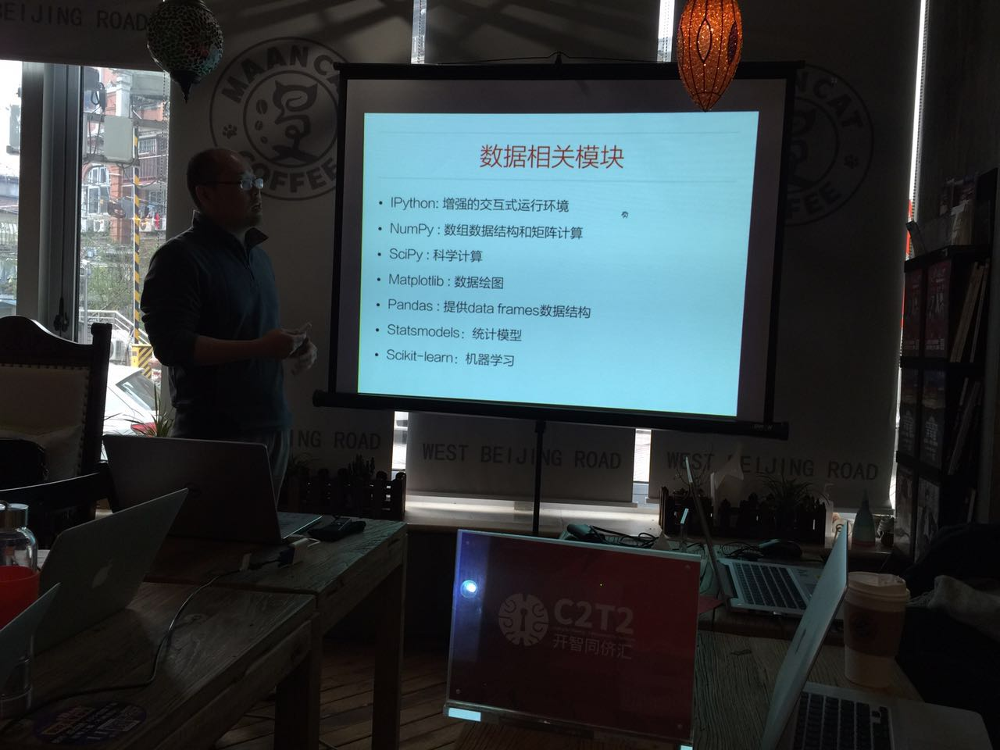
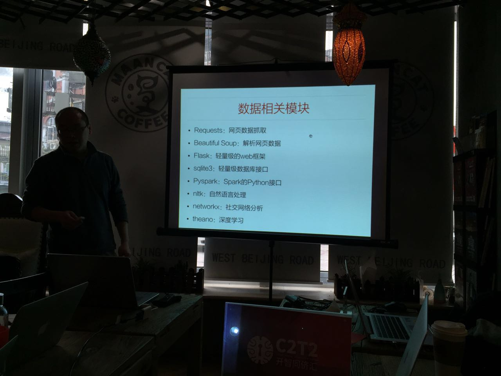
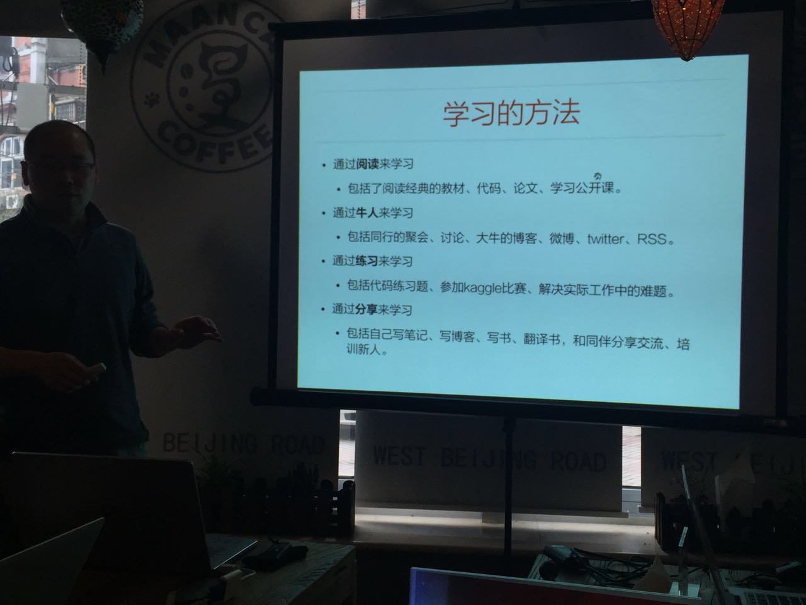
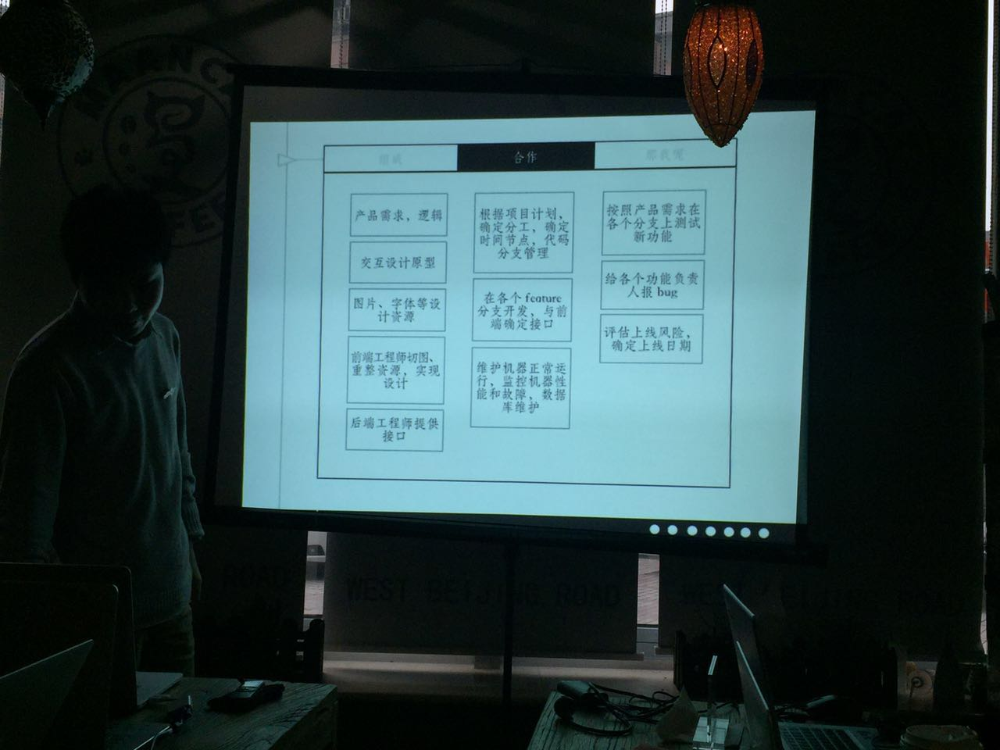
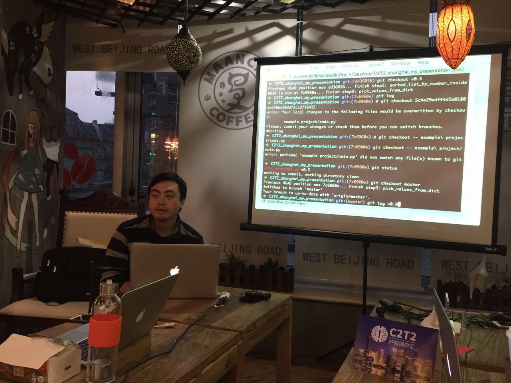
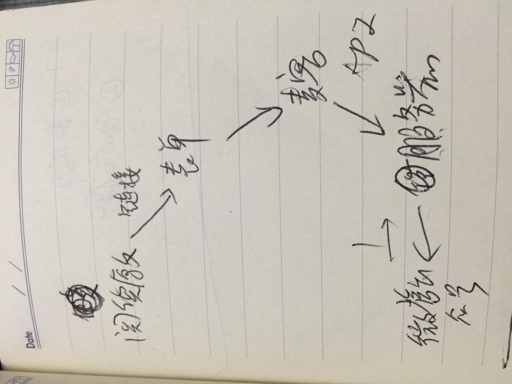

# c2t2 7w Summary

**感谢培炎教练的组织，社群数据库项目正式启动！**

## 1.肖凯 数据科学家
1)python可以在三个领域的应用,横跨各种领域

analyst/data developer/programmer

2）python vs R

python:35% python是一种通用编程工具，python长于机器学习

3)分析流程中的python

inquire--obtain--scrub--explore--model--interprete

4)数据相关模块

5）如何学习

## 2.haidao  python教练

我觉得目前来说，对于一个新的项目，比较重要的是把项目进行分解，确定项目的分工，确定时间节点和代码的分支管理。

## 3.赖博士
我觉得赖博士给我的启示是：看很多官方文档，把整个项目代码进行有效分解，也就是使用伪代码拆解。

## 4.组队成功

社群数据库项目正式启动！

* @Cher负责数据库

* @James负责微信+新浪云服务器

* @wp-lai做我们的观察员

产品设计逻辑

时间表：

* 8w:各自补全数据库/微信开发等知识，并开发各自的第一个版本

* 9w：完成社群数据库的第一个版本

* 10w：完成社群数据库的第二个版本

* 11w：42分钟路演

