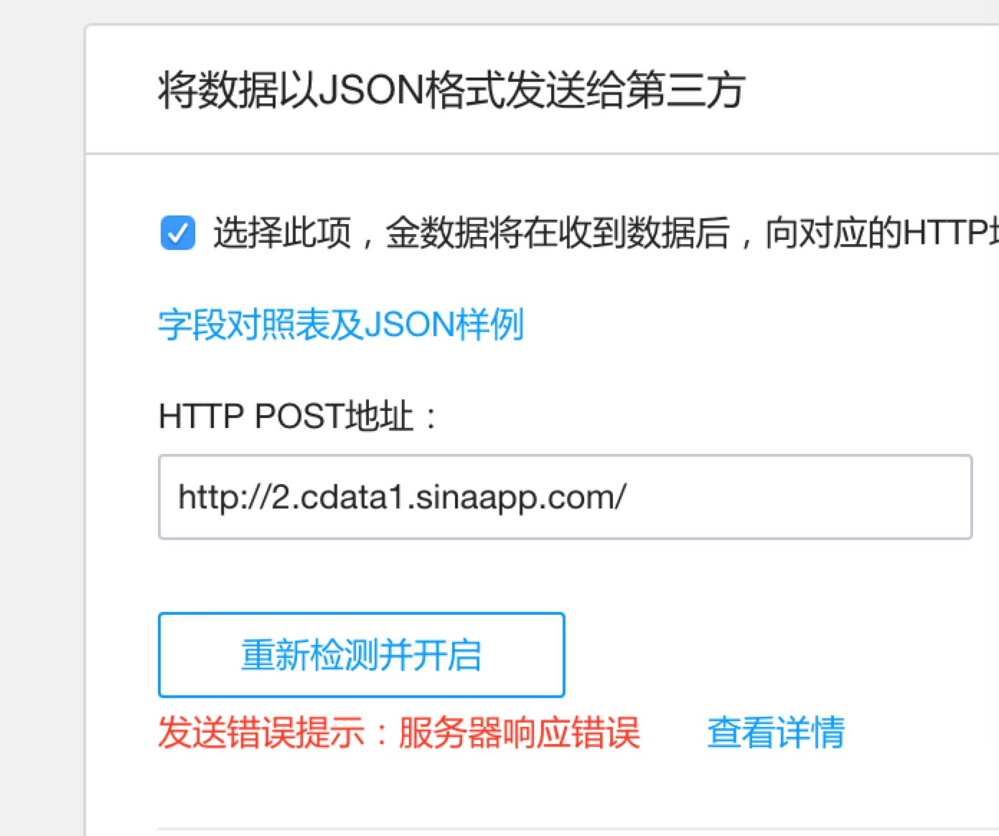
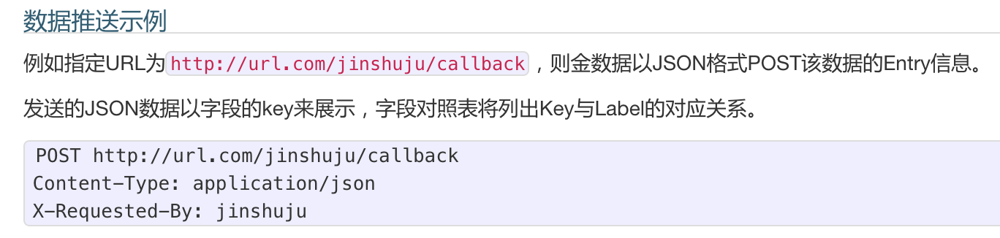
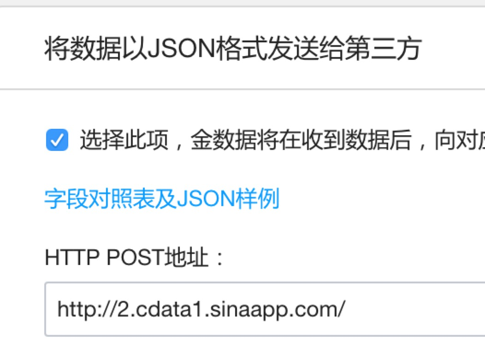
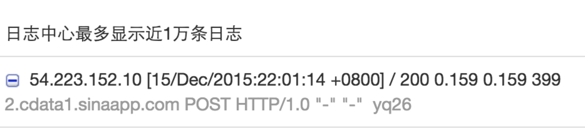

# debug1

接下来就是无尽的dubug。

首先，先来看 金数据这边的情况。

## 1.问题出现

    如果您想将某个表单新提交的数据推送到指定URL，
    您可以在表单的 设置 —— 数据提交 页面的底部找到将 
    数据以JSON格式发送给第三方，勾选开启后您将看到当前表单的字段对照表。
    
大概的意思是，只要在表单的设置里面勾选『数据以JSON格式发送给第三方』的选项，那么金数据便会把数据以json的格式发给服务器。

但是，结果是这样的：

## 2.辨别问题

经过赖博士提醒：
   
    @app.route('/',method="GET")
    def getdata_from_jishuju():
    """从金数据返回的数据中提取jason格式的信息
    """
    origin_data=request.params()

这里没有得到数据，应该把GET改成POST,因为官方文档里面说，JSON文档是以POST格式传送到指定url的。

同时，因为数据是在Entry信息的里面，读取信息应该用 body.read()。

## 3.debug

所以代码调整为：

    @app.route('/',method="POST")
    def getdata_from_jishuju():
    """从金数据返回的数据中提取jason格式的信息
    """
    origin_data=request.body.read()
    
经过这样的调整，似乎这个bug就解决了

* 金数据端

没有出现错误提示

* SAE服务器端

SAE给金数据返回了 statuscode为 200

statuscode==200   （成功）  
服务器已成功处理了请求。 通常，这表示服务器提供了请求的网页。

参考HTTP协议状态码详解（HTTP Status Code）
http://www.cnblogs.com/shanyou/archive/2012/05/06/2486134.html

