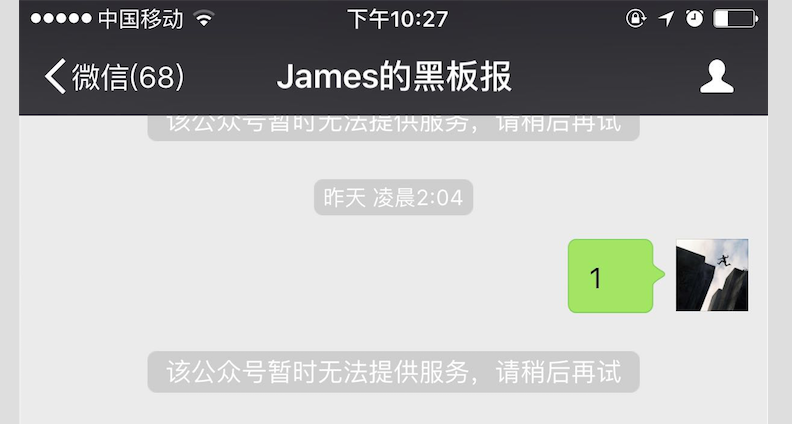
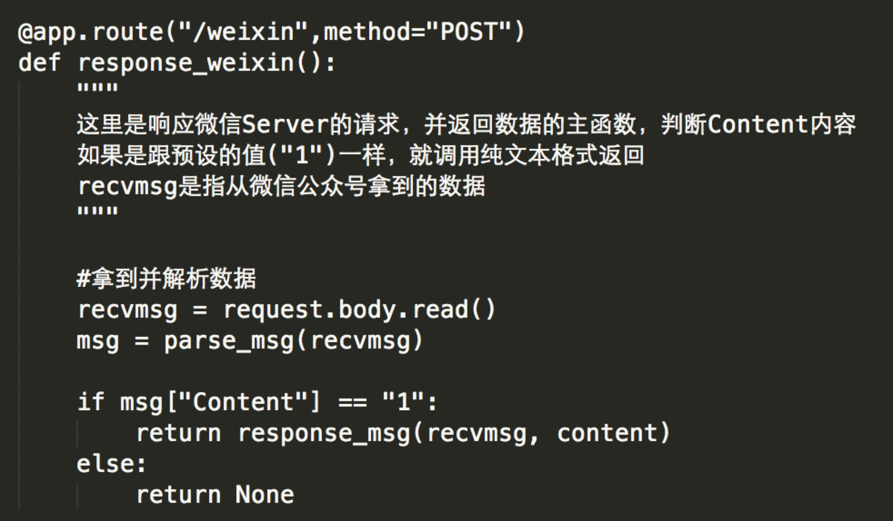
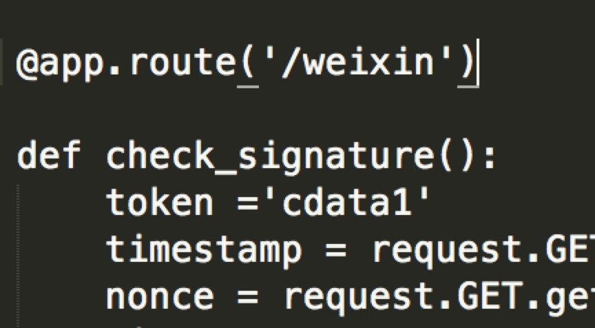

# debug2

微信端也遇到了一些Bug

## 1.问题

微信公众号无法提供服务！

## 2.辨别问题

1）赖博士观点

* 一个route只能对应一个函数

* 你返回信息给微信的函数没有对应的route
* 这里method应该是get，然后跟前面的route重复了，要把前面的删掉
 

根据赖博士的提示，修改好，然后进行测试。通过借用微信公众平台接口调试工具，检查是否获取access_token

