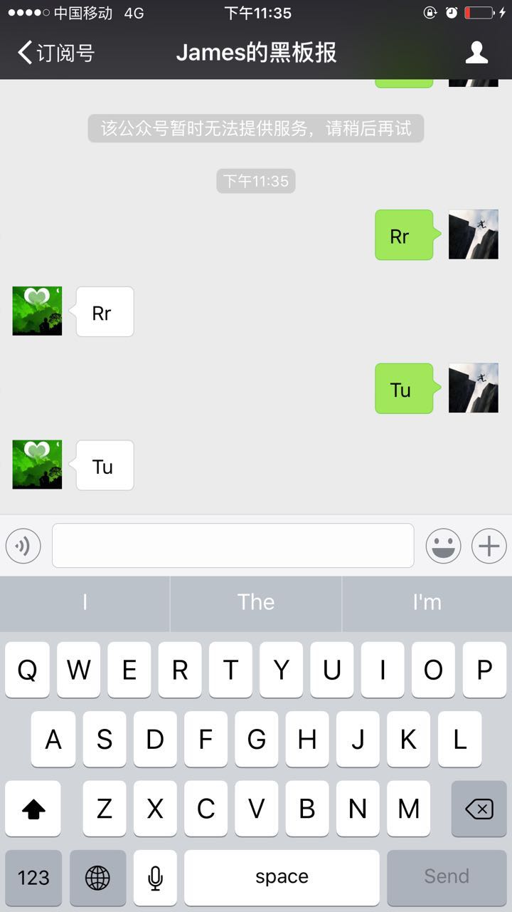

# debug3

有一些气馁，花了两个晚上debug都没有成功。分析原因，主要是没有去一个个排除可能的bug，而是去猜测。所以，接下来会排除一个一个的潜在bug.

1.金数据返回的数据格式不对

有可能金数据返回的数据，用request.body.read()读取后，用json.load不能解析成python格式。

所以我直接把content改成一个具体的数据，但是在微信公众后台上依然未能返回数据。说明，这个问题跟金数据的读取无关。

2.测试微信能否接受到普通的信息输入

http://mp.weixin.qq.com/wiki/17/fc9a27730e07b9126144d9c96eaf51f9.html

出现问题了

微信公众平台接口调试工具

SAE日志中心

3.进一步测试

为了确定问题在哪里，我尝试了赖博士的方法。

先尝试做一个echo server，把用户发送的信息原封不动回复回去

https://wp-lai.gitbooks.io/learn-python/content/1sTry/wechat.html

结果是，实现了这个功能。

说明都走通了，问题出现在金数据/sae/微信三者的交互上。

所以说，当发现有问题的时候，要从最原始的状态去测试，先确保基本框架可行再继续测试更复杂的内容。

