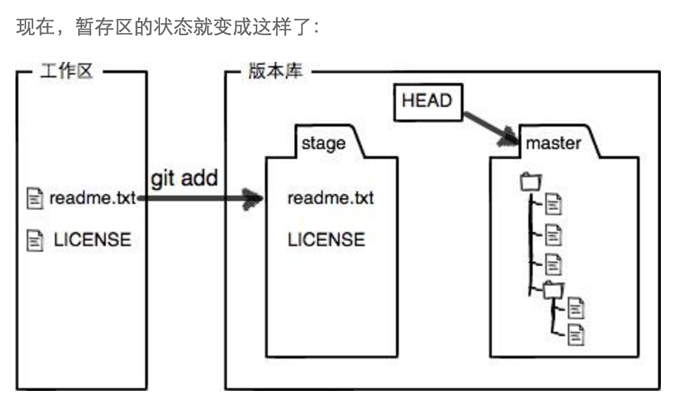
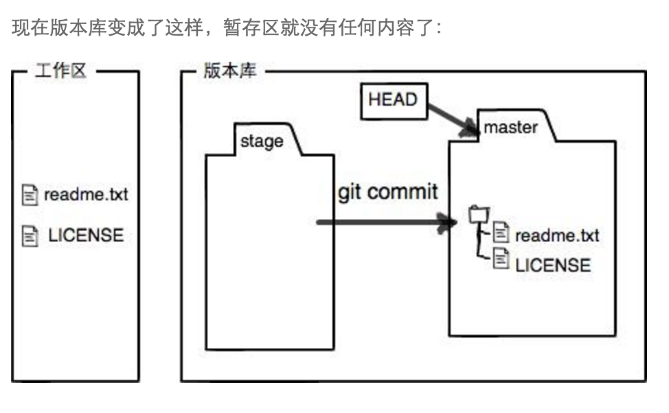

# git版本库

git的版本库是非常重要的概念，可以参考廖雪峰老师的网站

[(http://www.liaoxuefeng.com/wiki/0013739516305929606dd18361248578c67b8067c8c017b000/0013745374151782eb658c5a5ca454eaa451661275886c6000)]

所以向github远程更新代码应该分为三步

非常重要的三个步骤！
非常重要的三个步骤！
非常重要的三个步骤！

1. git add

2. git commit -m ""

3.git push origin master

