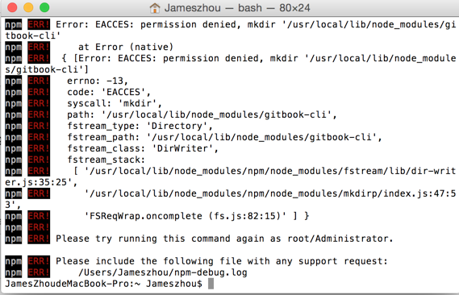

# gitbook&github

在开课这段时间，最难搞的其实是：将个人仓库和 gitbook 完成联动

操练过程中，发现问题在于：
    
    1.不清楚github和gitbook联动后的效果，导致无从着手
    2.对github还不够熟悉
    3.对gitbook不够熟悉，没有在电脑上装gitbook
    4.最重要的一点是，没有耐心读文档
    
国庆期间花了很多时间，不断去调整gitbook和github的设置，但是依然没有搞定。后来通过 1.阅读他人gitbook记录 2.当周课程 技术问题讨论 issue -- 来自大妈的回复 3.微信群互动 这三种途径搞定了 gitbook 和 github的联动问题。

主要过程如下：

    1.阅读官方文档，熟悉流程
    通过[zoe](https://zoejane.gitbooks.io/zoe-py-tutorial/content/gitbook-github.html)和[jeremiah](https://jeremiahzhang.gitbooks.io/gitbookguide/content/setup/gitbookinstall.html)两个人的gitbook，进一步读懂了gitbook官方文档中 [github integration](https://help.gitbook.com/github/index.html)的内容。
    2.解决gitbook setup的问题
    
    了解了terminal中如何 run this command as administrator
    
    

