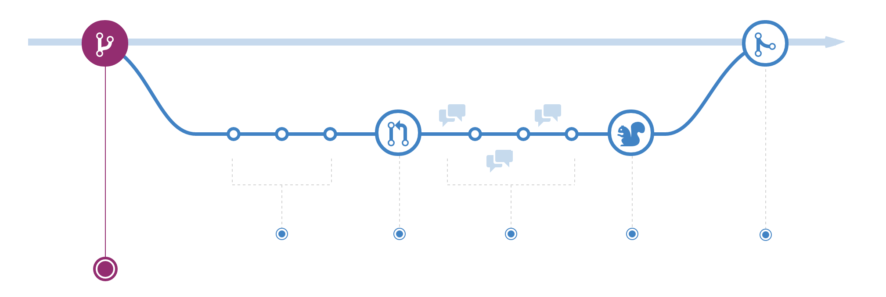

# github的使用规则

##领悟
最近领悟到的一个道理是：成功的事物刚开始实践起来是反直觉的.
参考paul graham的essay <[before startup>](http://www.paulgraham.com/before.html)

不知道为什么，遇到问题首先就是百度，我猜背后的心理是以为百度会给出很多有用的tricks。但是百度/google不一定会给出最优质的信息，很多官方解释文档的信息却能够对问题给出很完整的回答，github的使用就是这样的例子。

## 实践

### uderstanding the github flow
花了一点时间，研究了下github的[使用文档](https://guides.github.com/)。

最有用的图和段落是：

 Changes you make on a branch don't affect the 【master】 branch, so you're free to experiment and commit changes, safe in the knowledge that your branch won't be merged until it's ready to be reviewed by someone you're collaborating with.
 
 通过以上的配图和文字，我完整得认识到了github上面程序员工作的机制。
 
 
 
### Getting your project on GitHub

[这篇文档](https://guides.github.com/introduction/getting-your-project-on-github/)详细描述了github desktop的使用流程，该文档对 commit 的解释我很喜欢：All Git repositories are based on commits—snapshots of your code at a point in time.

结合我的一些小实践，对github desktop和github.com的互动机制有了更深入的了解。

 
 
 
 
 
 
 
 
 
 
 