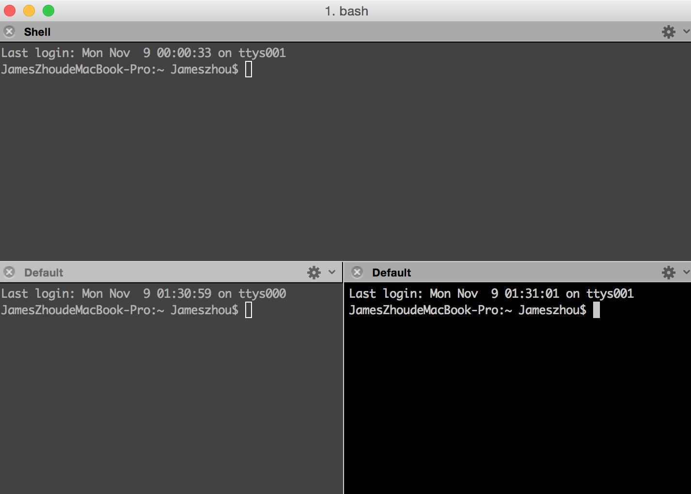

# 基础知识

## iterm2

http://www.iterm2.com/index.html

类型tumix的命令行工具，比较好用。

可以进行快速分屏，command+shift+D为上下分屏，command+D为左右分屏。

## UDP

### 有关UDP

http://zhidao.baidu.com/link?url=YSxgCSxg8xnGLofn7J0xiMZ03HmQwS7mWvyb_5ah9aSmMFezIyKLI6LUWM9_3Y4ulraZ4YbtpeNG96MNLC-8Zq

### 官方文档

https://docs.python.org/2.7/library/socket.html#example

### UDP&TCP

1.UDP用来支持那些需要在计算机之间传输数据的网络应用。包括网络视频会议系统在内的众多的客户/服务器模式的网络应用都需要使用UDP协议。

UDP协议从问世至今已经被使用了很多年，虽然其最初的光彩已经被一些类似协议所掩盖，但是即使是在今天UDP仍然不失为一项非常实用和可行的网络传输层协议。

2.与TCP不同，UDP协议并不提供数据传送的保证机制。如果在从发送方到接收方的传递过程中出现数据报的丢失，协议本身并不能做出任何检测或提示。因此，通常人们把UDP协议称为不可靠的传输协议。

相对于TCP协议，UDP协议的另外一个不同之处在于如何接收突发性的多个数据报。不同于TCP，UDP并不能确保数据的发送和接收顺序。

3.反观UDP由于排除了信息可靠传递机制，将安全和排序等功能移交给上层应用来完成，极大降低了执行时间，使速度得到了保证。

## C/S

1.C/S 结构，即大家熟知的客户机和服务器结构。它是软件系统体系结构，通过它可以充分利用两端硬件环境的优势，将任务合理分配到Client端和Server端来实现，降低了系统的通讯开销。

2.Client和Server常常分别处在相距很远的两台计算机上，Client程序的任务是将用户的要求提交给Server程序，再将Server程序返回的结果以特定的形式显示给用户；Server程序的任务是接收客户程序提出的服务请求，进行相应的处理，再将结果返回给客户程序。
