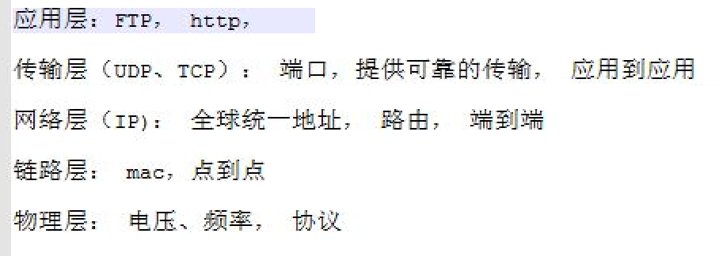

# Offline C2T2
先上图

今天主要讲了以下几个知识点

## 1.OSI参考模型

## 2.wireshark
https://www.wireshark.org/

## 3.如何引用其他脚本的函数（import）

jamesmod.py
    
    def get_text():
	    a =  "this is all your history notes"
	    return a

jamescaller.py

    import jamesmod
    print "print history"
    print jamesmod.get_text()

jamescaller.py这个脚本就引用了jamesmod.py这个脚本的 get_text()函数。

只要写jamesmod.get_text()就可以了。当然里面有一个老梗~~~

老梗之：

    if __name__ == '__main__':
        main()

（待补充）

## 4.3w作业的讲解

### 1）参数

history_message = jamesdiary.readdiary()

jamesdiary.writediary(**data**)

为什么这两个函数都调用jamesdiary.py的函数，但是（）里面的参数不一样？

### 2）为什么Break要放到这里？

    while True:
        data, address = sock.recvfrom(4096)
        ~~（从客户端接受数据）~~
        if data == 'q':
            break

（待补充）

