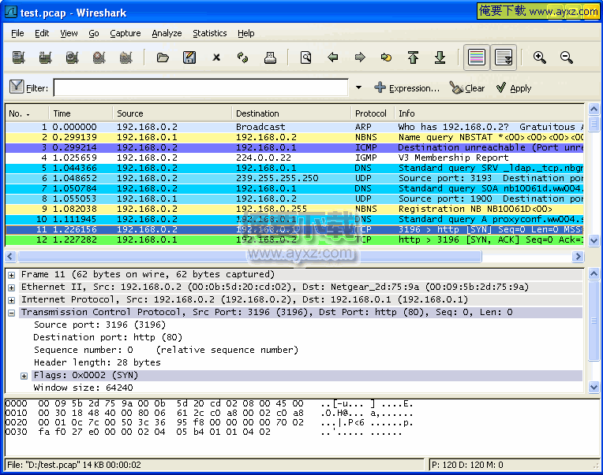

# Offline C2T2
先上图

今天主要讲了以下几个知识点

## 1.OSI参考模型

## 2.wireshark
https://www.wireshark.org/

Wireshark（前称Ethereal）是一个网络封包分析软件。网络封包分析软件的功能是撷取网络封包，并尽可能显示出最为详细的网络封包资料。

## 3.如何引用其他脚本的函数（import）

jamesmod.py
    
    def get_text():
	    a =  "this is all your history notes"
	    return a

jamescaller.py

    import jamesmod
    print "print history"
    print jamesmod.get_text()

jamescaller.py这个脚本就引用了jamesmod.py这个脚本的 get_text()函数。

只要写jamesmod.get_text()就可以了。当然里面有一个老梗~~~

老梗之：

    if __name__ == '__main__':
        main()

（待补充）

## 4.3w作业的讲解

3W的作业基本上是在这次C2T2里面完成的，😢。

感谢培炎教练的悉心指导，把3W作业里面遇到的一些需要注意的点分享给大家。

### 1）参数

history_message = jamesdiary.readdiary()

jamesdiary.writediary(**data**)

为什么这两个函数都调用jamesdiary.py的函数，但是（）里面的参数不一样？

### 2）为什么Break要这么放？

在服务端，用户退出可以用if...break，不过应该放在哪里比较合适？

为什么是放在服务端的主函数Main()里面？

    while True:
        data, address = sock.recvfrom(4096)
        ~~（从客户端接受数据）~~
        **if data == 'q':
            break**
        response1(sock, data, address)
    sock.close()

而不是放在对response1的定义里面？

    def response1(sock, data, address):
        if data == 'P':
            history_message = jamesdiary.readdiary()
        sent = sock.sendto(history_message, address)
        **elif data=="q"
            break**
        else: 
            sent = sock.sendto(data, address)
            jamesdiary.writediary(data)

（待补充）

