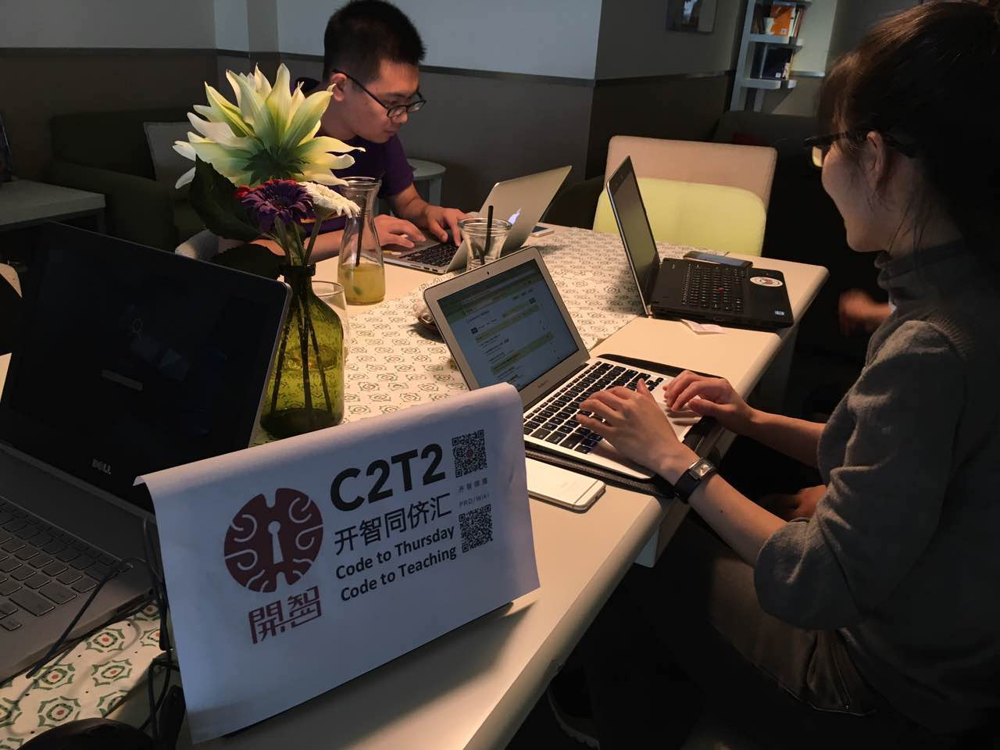
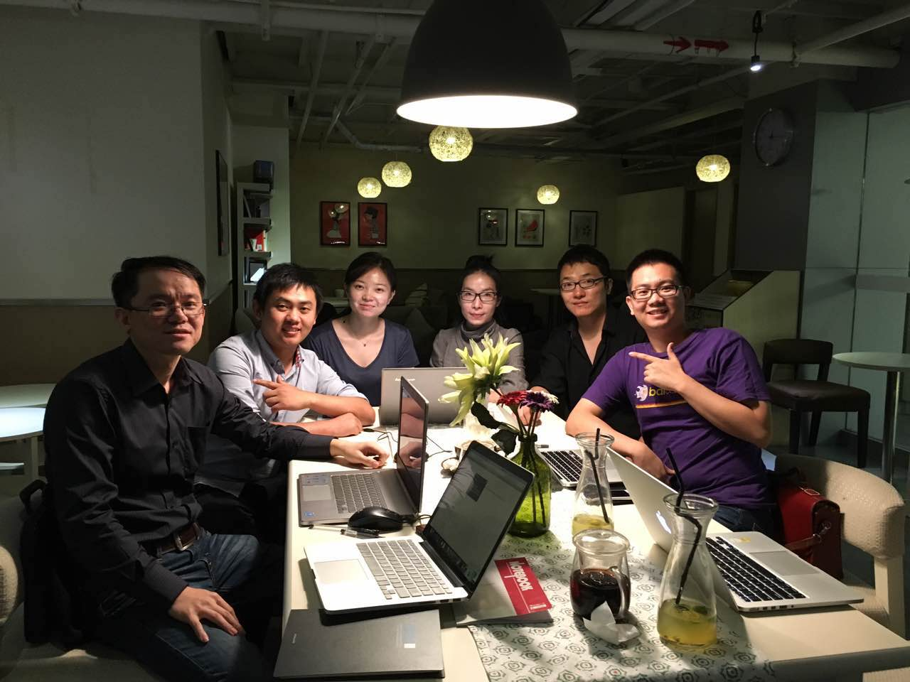

# offline C2T2

## 先上图

感谢教练挑了一个近一点的地方，一点钟就来报道了：）

主要是因为1w的课程还没写完😢

## 同学们的进展

不知道是不是git/github/gitbook之间的关系太复杂，还是大家上班都很辛苦，还是两者都有，上海这边同学进展比较慢，大多处于0w~1w之间。

希望大家多加油，不然两周一次的聚会节奏肯定解决不了积压的问题。

## 今日收获

1.用 git 同步github
之前的github本地和云端的同步是用github desktop同步的，

2.CLi的使用

3._name_

4.peer learning

