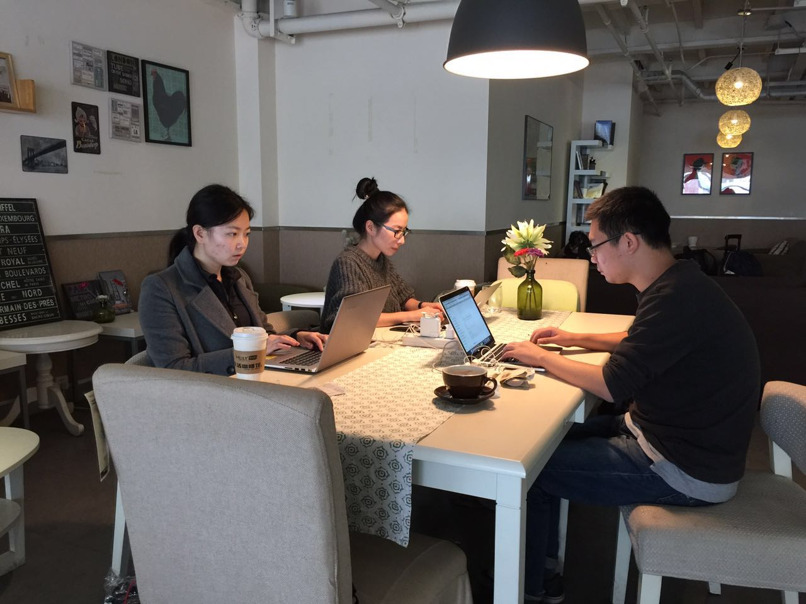

# Offline C2T2 W4

先上图

发起和参与了这次上海的C2T2活动，主要原因是觉得有必要学员们每周都聚一次，这样大家可以相互监督/学习。

本次活动总共有三个人参加。需要探讨的是，为什么本次活动参加的人不是很多。是因为大家没有收到群里面的消息，还是因为太忙，通知太晚？争取以后自发组织的活动也可以有很多人：）

本次C2T2主要探讨了一个问题：

1）相互讨论学习经验

如何快速的做完一周的作业？需要准备的资料有：官方文档、大妈的讲课视频、芝麻星的提示、大牛同学的官方笔记。这些资料放在一起看的时候，信息量很大，但是会让大家融会贯通。

2）发现问题

发现两个同学停留在2w的作业里面，所以觉得应该有一部分同学还停留在比较早的作业里面。

同学们还是有点轴，希望可以循序渐进的做完作业。不过确实每个作业都是独立的，并不一定要一个接着一个做。我觉得class是目前最难理解的概念，所以导致很多同学的作业停留在2w。

后记：

本次活动持续时间不久，同时大家都在赶作业，所以交流不是很深入，期待下一次大家的深入交流。

