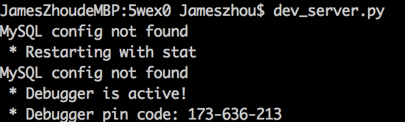
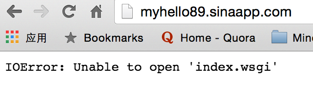
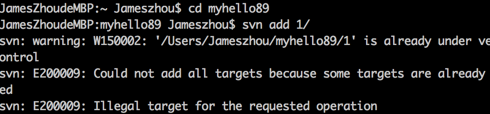
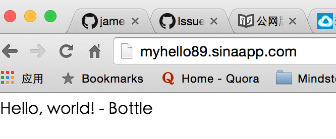

# SAE入门

1.部署本地sae-python开发环境

可以选择用pip安装
   
    $ pip install sae-python-dev
    
2.基本使用

建立index.wsgi和config.yaml两个文件
以sae官方的bottle代码为例
index.wsgi
    
    from bottle import Bottle, run
    import sae
    app = Bottle()
    @app.route('/')
    def hello():
        return "Hello, world! - Bottle"
    application = sae.create_wsgi_app(app)
    

   运行如下的命令启动测试server： 遇到一个问题
  

访问 http://localhost:8080 端口的时候不能访问应用。出现什么问题了吗？

3.Linux/Mac用户入门指南
    
实践了[Linux/Mac用户入门指南](http://www.sinacloud.com/doc/sae/tutorial/helloworld-for-linux-mac.html)出现了以下错误

于是在同样目录中放入Bottle.py以及index.wsgi等文件。

接下来尝试了 [python 入门指南](http://www.sinacloud.com/doc/sae/python/tutorial.html#hello-world)
发现也出现了同样的问题

命令行运行的时候出现了以下情况

百度了下，得到了以下提示
http://www.cnblogs.com/piercalex/p/4045735.html
执行跟这个网页同样的操作。 --force

提交刚刚编辑的代码，就可以完成应用在SAE上的部署。

    svn add 1/
    svn ci -m "initialize project"
在浏览器中输入 http://myhello89.sinaapp.com ，得到以下结果，跟index.wsgi的设置相同。

    
    
    
    
    
    
    
    
    