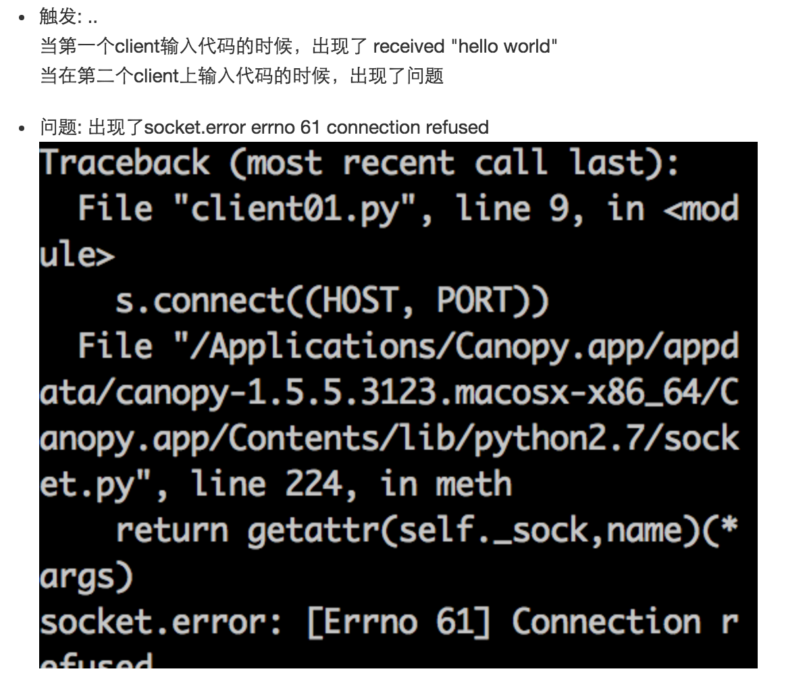
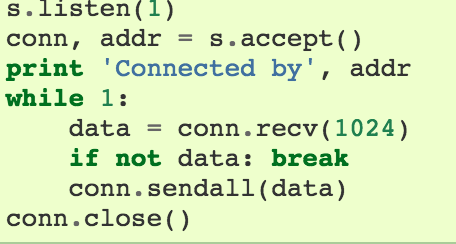
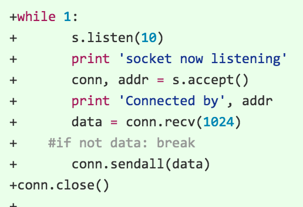
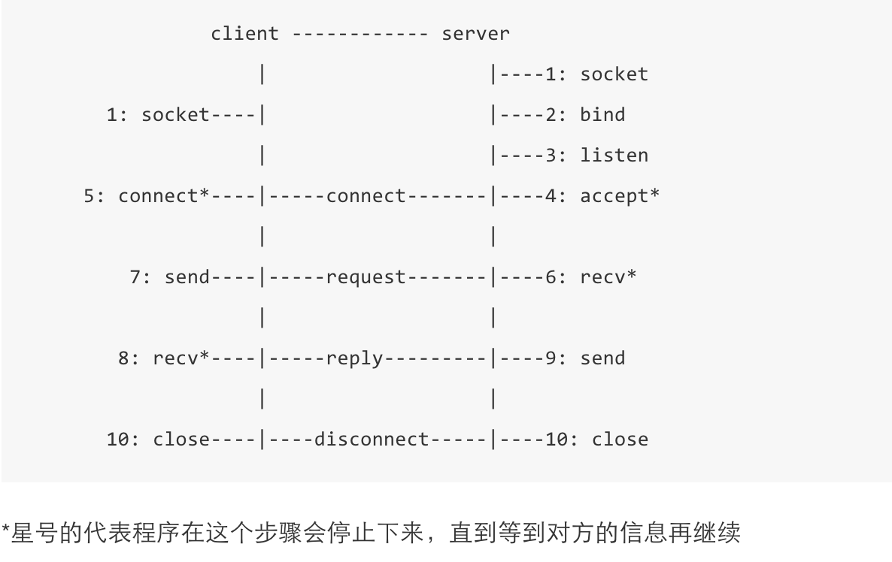

# try socket

## 最小udp
参考了python的官方文档，写了最小的udp。

具体代码请点击：[最小UDP](https://github.com/jameszhou89/OMOOC2py/commit/5a48b63888b898b9fa9eb4916eb36424d73fe02e)

以上的代码有一些修改，不然会有一些坑，如图：

官方代码存在的问题在于，socket只listen一遍，导致不能重复listen

只要做出如下修改即可：

## 再理解UDP

发现之前的代码是STREAM，属于TCP/IP协议。😓

按照wp-lai的提示，找到了这篇文档[：User Datagram Client and Server](https://pymotw.com/2/socket/udp.html)

Where TCP is a stream oriented protocol, ensuring that all of the data is transmitted in the right order, UDP is a message oriented protocol. 
   
   UDP does not require a long-lived connection, so setting up a UDP socket is a little simpler. 

以下图是socket的运行机制

