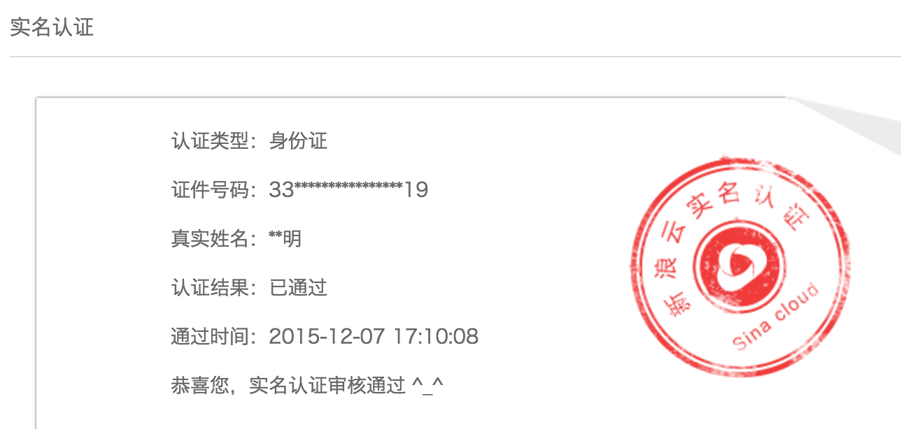
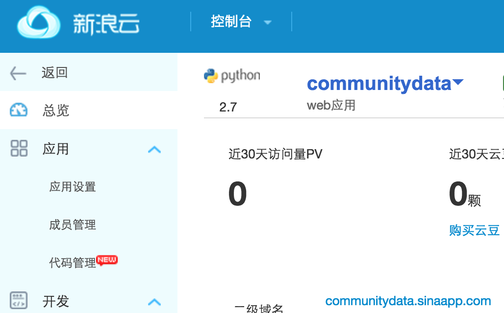
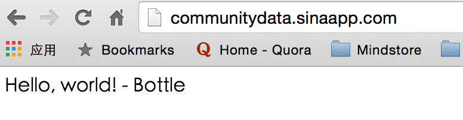

# 参考资料

1）[微信公众平台开发者文档](http://mp.weixin.qq.com/wiki/home/index.html)

2）[赖博士文档](https://wp-lai.gitbooks.io/learn-python/content/1sTry/wechat.html)

3）[zoe文档](https://zoejane.gitbooks.io/omooc2py/content/1sTry/diary-weixin.html)

4）廖雪峰：[微信公众平台后台接入简明指南](http://www.liaoxuefeng.com/article/0013900476318564121d01facf844cba508396f95d9bb82000)

5）[Token验证失败的解决方法](http://www.cnblogs.com/txw1958/p/token-verify.html)

6）[微信公众平台开发(免费云BAE+高效优雅的Python+网站开放的API)](http://www.cnblogs.com/weishun/p/weixin-publish-developing.html)

7）[一个用Python和Bottle实现基于微信公众平台API和SAE查询豆瓣电影的简单应用](http://kingson.org/?p=259)

8）[在SAE上搭建微信公众平台账号消息服务器](http://www.cnblogs.com/gzb1985/archive/2012/12/30/weixin-msg-server-based-on-sae-python.html)

#  微信公众号平台接入

## 注册微信公众号

注册了一个《James的黑板报》的微信公众号，微信号地址是： James-zhou89

## 在SAE上创建Python应用

1)实名认证SAE帐号

2）创建了communitydata这个应用

3)communitydata应用在SAE上的创建和部署

参考了[入门指南](http://www.sinacloud.com/doc/sae/python/tutorial.html#shi-yong-web-kai-fa-kuang-jia)，进行了初步的创建和部署

### 但是，实际情况要更复杂！

跟赖博士请教了下，了解到了部署的坑

需要通读[代码部署手册](http://www.sinacloud.com/doc/sae/tutorial/code-deploy.html#svn)

同时，需要在SAE中check [sae代码管理面板](http://sae.sina.com.cn/?m=vermng&app_id=myhello89&ver=1)

##微信公众号填写服务器配置

首先要了解的是什么是URL和Token。

URL就是放置了接口程序的网址，这个网址一般得是你自己的服务器或空间地址。你自己在这个空间上某个目录已经有接口程序了，你知道这个接口程序在互联网上的访问地址是什么。

而Token就是一个令牌，该令牌是个数字或字母形式的字符串，用于微信服务器与你的服务器进行通讯的时候的身份验证。防止非法数据来搞乱。

### 问题
输入设定的URL和Token之后，出现了 「token验证失败」或者「URL请求超时」

