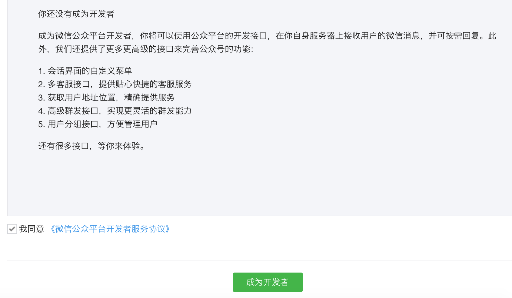

# 微信公众号

## 相关资料
1）微信公众平台开发者文档

http://mp.weixin.qq.com/wiki/home/index.html

2）赖博士文档

https://wp-lai.gitbooks.io/learn-python/content/1sTry/wechat.html

3）zoe文档

https://zoejane.gitbooks.io/omooc2py/content/1sTry/diary-weixin.html

## 注册微信公众号

注册了一个《James的黑板报》的微信公众号，微信号地址是： James-zhou89

## 注册成为开发者

## 填写服务器配置

### 参考文章

1）廖雪峰：[微信公众平台后台接入简明指南](http://www.liaoxuefeng.com/article/0013900476318564121d01facf844cba508396f95d9bb82000)

2）[微信公众平台开发(免费云BAE+高效优雅的Python+网站开放的API)](http://www.cnblogs.com/weishun/p/weixin-publish-developing.html)

3）[一个用Python和Bottle实现基于微信公众平台API和SAE查询豆瓣电影的简单应用](http://kingson.org/?p=259)

4）[在SAE上搭建微信公众平台账号消息服务器](http://www.cnblogs.com/gzb1985/archive/2012/12/30/weixin-msg-server-based-on-sae-python.html)

