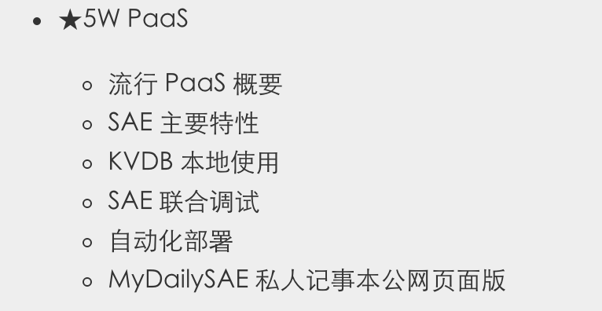

# Week5

任务要求

    将上周应用网站发布为公网稳定服务
    可以通过固定域名访问系统:
    每次运行时合理的打印出过往的所有笔记
    一次接收输入一行笔记
    在服务端保存为文件
    
    同时兼容 3w 的 Net 版本的命令行界面进行交互
        可以通过本地命令行工具监察/管理网站:
        获得当前笔记数量/访问数量等等基础数据
        可以获得所有笔记备份的归档下载

